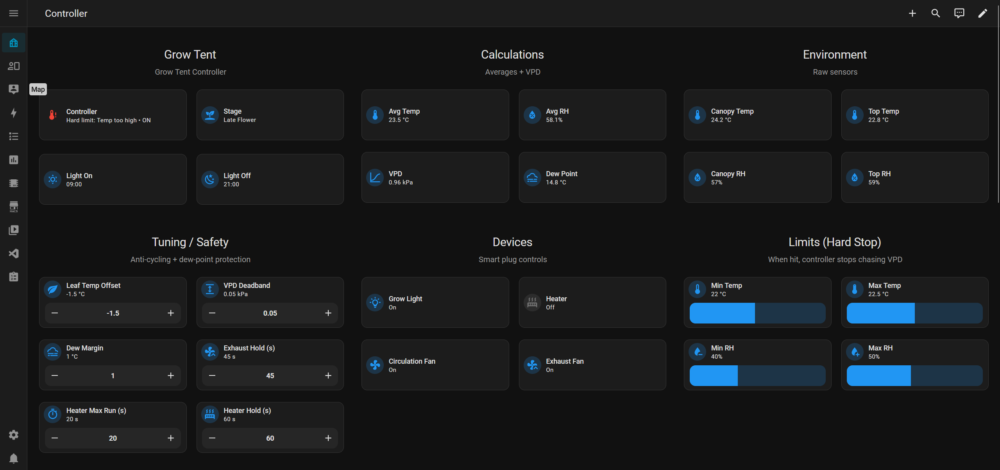

# Small Grow Tent Controller (Home Assistant Integration)

A Home Assistant custom integration to control and monitor a small grow tent.

> **Status:** early development (pre-1.0). Expect breaking changes until a stable release is tagged.

## Features

- Config Flow UI setup
- Entities for sensors, switches, numbers, selects, and time helpers (see Entities section after installation)

## Installation

### Option A — HACS (custom repository)

1. In Home Assistant, open **HACS → Integrations**.
2. Open the menu (⋮) → **Custom repositories**.
3. Add this repository URL and choose **Integration** as the category.
4. Install **Small Grow Tent Controller**.
5. Restart Home Assistant.

### Option B — Manual

1. Copy the folder `custom_components/small_grow_tent_controller/` into:
   `config/custom_components/small_grow_tent_controller/`
2. Restart Home Assistant.

## Configuration

Go to **Settings → Devices & services → Add integration** and search for:

**Small Grow Tent Controller**

Follow the wizard.

📊 Dashboard example (v0.1.7+)

An example Lovelace dashboard is provided in:

Examples/dashboard.yaml

This dashboard is designed to work out of the box with the integration and provides:

Controller status and stage selection

Environmental calculations (averages, VPD, dew point)

Device controls (light, fans, heater, humidifier, dehumidifier)

Safety tuning and hard limits

Grow cycle tracking and trends

✨ Automatic device-aware UI (v0.1.7+)

Starting with v0.1.7, the integration exposes per-device enable flags as binary sensors.
These allow the dashboard to automatically hide controls and tuning options for devices that are disabled in the integration configuration.

This keeps the UI clean when you are not using all supported devices.

🔌 Device enable binary sensors

For each optional device, the integration creates a binary sensor that reflects whether that device is enabled in the integration configuration:

Binary sensor entity	Meaning
binary_sensor.use_light_control	Grow light control enabled
binary_sensor.use_circulation_fan_control	Circulation fan enabled
binary_sensor.use_exhaust_fan_control	Exhaust fan enabled
binary_sensor.use_heater_control	Heater enabled
binary_sensor.use_humidifier_control	Humidifier enabled
binary_sensor.use_dehumidifier_control	Dehumidifier enabled

These sensors:

Are ON when the device is enabled in Settings → Devices & Services → Integrations → Small Grow Tent Controller → Configure

Update automatically when configuration options change

Require no helpers or manual synchronization

🧩 How the dashboard uses these sensors

The example dashboard uses Lovelace conditional cards to show or hide UI elements dynamically.

For example, the humidifier device card is only shown when humidifier control is enabled:

type: conditional
conditions:
  - entity: binary_sensor.use_humidifier_control
    state: "on"
card:
  type: custom:mushroom-entity-card
  entity: switch.humidifiergrowtent
  name: Humidifier

The same pattern is used for:

Device control cards

Device-specific tuning sliders (e.g. hold times)

Light schedule cards

As a result:

Disabled devices do not appear in the dashboard

“Entity not found” warnings are avoided

The layout adapts automatically to partial setups

✅ Recommended usage

Use Examples/dashboard.yaml as a starting point

Keep device enable/disable decisions in the integration configuration, not the dashboard

Let the dashboard react automatically via the binary_sensor.use_* entities

This approach ensures a single source of truth and a clean, maintenance-free UI.

📁 Location:
examples/dashboard.yaml

### Requirements
This dashboard uses the following custom cards (install via HACS):
- layout-card (with grid-layout)
- Mushroom cards
- button-card
- card-mod

### How to use

1. Open Home Assistant
2. Go to **Settings → Dashboards**
3. Add a **YAML dashboard**
4. Copy the contents of `examples/dashboard.yaml`
5. Adjust entity IDs to match your setup

## Support

- Issues: https://github.com/ferreirajcsf/small-grow-tent-controller/issues

## Development

Recommended checks before publishing a release:

- `hassfest`
- `ruff` / `flake8`
- `pytest` (if you add tests)

## License

MIT (see `LICENSE`).
