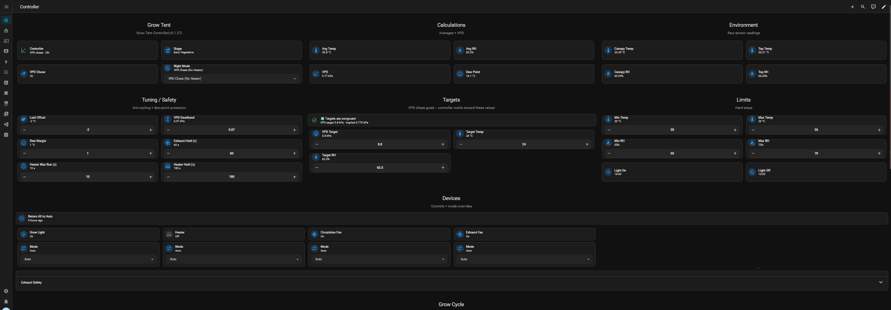

[](https://hacs.xyz/)
[](https://github.com/ferreirajcsf/small-grow-tent-controller/releases)
[](LICENSE)

# 🌱 Small Grow Tent Controller

A Home Assistant custom integration that automatically monitors and controls the environment inside a small grow tent — keeping temperature, humidity, and VPD where your plants need them, around the clock.

> **Status:** Active development (pre-1.0). Core control logic and MPC are stable and running in production. Expect occasional breaking changes until v1.0 is tagged.

---

## What does it do?

Running a grow tent means juggling a lot of variables — temperature, humidity, light schedules, airflow, and more. This integration takes care of all of it automatically, so you don't have to babysit your setup.

Every 10 seconds it reads your sensors, calculates VPD and dew point, and decides what to do with your connected devices. You just set your targets and let it run.

---

## Features

**Smart environmental control**
- Continuously chases your target VPD for each growth stage
- Calculates leaf-surface VPD (with configurable leaf temperature offset) for more accurate control
- Automatic dew point calculation and dew-point protection at night
- Hard safety limits for temperature and humidity that kick in before things go wrong
- Target conflict detection — warns you when your Target Temperature and Target Humidity settings imply a different VPD than your VPD Target

**Flexible device support**

All devices are optional — only enable what you actually have:

| Device | What it controls |
|---|---|
| 🔆 Light | On/off by schedule |
| 💨 Circulation fan | On whenever controller is active (day and night), off during drying and when controller is disabled |
| 🌬️ Exhaust fan | Temperature, humidity, and VPD management. Mode options: Auto, On, Off, Day On (on during light window), Night On (on during dark window) |
| 🔥 Heater | Temperature and dew-point protection |
| 💧 Humidifier | VPD and humidity management |
| 🧊 Dehumidifier | VPD and humidity management |

**Growth stage presets**

Switch between stages and the controller automatically adjusts its VPD, temperature, and humidity targets:

| Stage | Default VPD | Default Temp | Default RH | Adjustable? |
|---|---|---|---|---|
| Seedling | 0.70 kPa | 24°C | 70% | ✅ Yes |
| Early Vegetative | 0.95 kPa | 25°C | 60% | ✅ Yes |
| Late Vegetative | 1.10 kPa | 26°C | 55% | ✅ Yes |
| Early Bloom | 1.25 kPa | 26°C | 50% | ✅ Yes |
| Late Bloom | 1.45 kPa | 25°C | 45% | ✅ Yes |
| Drying | 0.90 kPa | 21°C | 55% | ✅ Yes |

All three target values (VPD, temperature, RH) reset to their stage defaults when you change stage (~10 second delay). Each can be nudged freely at any time.

**Night mode options**

During the lights-off window the controller can operate in one of two modes, selectable from the Tuning/Safety section:

| Mode | Behaviour |
|---|---|
| **Dew Protection** *(default)* | Heater pulses to stay above dew point + margin. Humidifier off. Dehumidifier if RH too high. Exhaust follows stage night profile. |
| **VPD Chase** | Full VPD chase at night using night targets (VPD, temp, RH). Dew-point protection always active as a hard floor. Stage exhaust night profile still applied. |
| **VPD Chase (No Heater)** | Same as VPD Chase but heater is excluded from chasing VPD. Dew-point protection still fires unconditionally. |
| **MPC** | Model Predictive Control using night targets and the identified thermal model. Dew-point floor and stage exhaust profile still enforced. |

**Day mode options**

During the lights-on window the controller can operate in one of three modes, selectable from the Grow Tent section of the dashboard:

| Mode | Behaviour |
|---|---|
| **VPD Chase** *(default)* | Actively chases VPD, temperature, and RH targets using all available devices. |
| **MPC** | Model Predictive Control — uses an identified first-order thermal model to plan heater and exhaust actions several steps ahead, reducing overshoot and compensating for actuator lag. |
| **Limits Only** | Only hard temperature and humidity limits are enforced. Devices are left neutral inside the limits. |

**MPC (Model Predictive Control)**

Available for both day and night modes. At each poll cycle the MPC evaluates all combinations of heater/exhaust states over a configurable planning horizon (1–6 steps, default 3), simulates tent temperature and RH forward using a first-order thermal model, and selects the sequence that minimises a weighted cost of VPD error, temperature error, RH error, and unnecessary switching. Only the first step of the optimal plan is executed.

Model parameters are identified from your real sensor history using the included `mpc_identify.py` script. The ambient temperature and RH used by the model can be kept current automatically by assigning a lung room sensor in **Settings → Devices & Services → Small Grow Tent Controller → Configure**.

Key diagnostic sensors (hidden by default, enable in **Settings → Entities**):
- `debug_mpc_pred_temp` — predicted temperature at end of horizon
- `debug_mpc_pred_vpd` — predicted VPD at end of horizon
- `debug_mpc_plan` — first 3 steps of the chosen action sequence
- `debug_mpc_score` — cost of the chosen plan (lower = better)

**Grow Journal**
- Built-in timestamped grow log — record observations, training events, nutrient changes, anything
- Notes persist across restarts in HA's `.storage` directory
- Add notes from the dashboard via a text input; clear the last entry or all entries with one tap
- Accessible via the `small_grow_tent_controller.add_note` service for automations

**Safety features**
- **Heater safety shutoff on sensor dropout** — if sensors become unavailable while the heater is running, it is immediately turned off (blocking call) to prevent uncontrolled overheating. Normal control resumes automatically when sensors recover.
- **Heater max run time** — configurable safety cutoff with automatic lockout if the heater runs continuously too long (0 = disabled)
- **Exhaust safety** — when enabled, the exhaust fan cannot be turned off by *any* part of the control logic (including hard limits, night mode, VPD chase, or manual Off override) while temperature or humidity exceed the configured safety thresholds. This is a true system-wide safety, not just a manual-override guard.
- Anti-cycling protection via configurable hold times (prevents rapid on/off switching)
- Controller can be fully disabled while keeping manual device overrides active

**Per-device manual overrides**

Each device has a mode selector with the following options:

| Option | Behaviour |
|---|---|
| **Auto** | Controller manages the device automatically |
| **On** | Device forced on every cycle, regardless of conditions |
| **Off** | Device forced off every cycle, regardless of conditions |

Use the **Return All Devices to Auto** button to hand everything back to the controller in one tap. Overrides are enforced every poll cycle, so the controller will correct any unexpected state change within ~10 seconds.

**Entities created automatically**

Once set up, the integration creates a full set of entities grouped under a single device in your HA UI:
- Sensors for average temperature, humidity, VPD, dew point, leaf temperature, control mode, and last action
- Switches for the controller, VPD Chase, exhaust safety override, RLS adaptation, and MPC auto-identify weekly
- Number sliders for all limits, targets, deadbands, hold times, MPC model parameters, and RLS forgetting factor
- Select entities for growth stage, day mode, night mode, and per-device modes
- Time helpers for your light on/off schedule
- Buttons: Return All Devices to Auto, Re-identify MPC Model
- Diagnostic sensors for MPC model fit quality (R² temp, R² RH, last identified timestamp) — hidden by default

> **Tip:** There are also diagnostic `debug_*` sensors that show exactly what the controller is thinking (heater target, exhaust policy, light schedule logic, etc.). They're hidden by default — enable them individually via **Settings → Entities** if you want to dig into the details.

---

## Prerequisites

Before setting up the integration, you'll need:

- **Home Assistant** — any recent version with HACS support
- **2 temperature + 2 humidity sensors** — one set at canopy level, one at the top of the tent (the integration averages them). A single sensor at each location works fine too — just point both slots at the same entity.
- **Switch entities for your devices** — any device you want to control needs to be exposed as a `switch` entity in HA (smart plugs, Zigbee relays, etc.)

---

## Installation

### Option A — HACS (recommended)

1. In Home Assistant, open **HACS → Integrations**
2. Click the menu (⋮) in the top right → **Custom repositories**
3. Paste `https://github.com/ferreirajcsf/small-grow-tent-controller` and select **Integration** as the category
4. Click **Add**, then find and install **Small Grow Tent Controller**
5. Restart Home Assistant

### Option B — Manual

1. Download the latest release from the [Releases page](https://github.com/ferreirajcsf/small-grow-tent-controller/releases)
2. Copy the `custom_components/small_grow_tent_controller/` folder into your HA config directory:
   ```
   config/custom_components/small_grow_tent_controller/
   ```
3. Restart Home Assistant

---

## Configuration

### Step 1 — Add the integration

Go to **Settings → Devices & Services → Add Integration** and search for **Small Grow Tent Controller**.

### Step 2 — Choose your devices

The first screen asks which devices you actually have. Toggle off anything you don't want the controller to manage — this hides irrelevant entities and keeps your UI clean.

### Step 3 — Assign your entities

The second screen asks you to pick the HA entity for each sensor and device switch. These are the entities the integration will read from and control.

After setup, all entities appear under a single device card named after your config entry. If you run multiple tents, add the integration again and give each entry a different name (e.g. "Veg Tent", "Flower Tent").

To assign a lung room sensor for MPC ambient tracking, go to **Settings → Devices & Services → Small Grow Tent Controller → Configure** after the integration is set up.

### Step 4 — Set your targets

Once the integration is running, tune it from the entity controls in your dashboard or the device page:

| Setting | What it does |
|---|---|
| **Stage** | Sets the active growth stage and resets VPD, temperature, and RH targets to stage defaults |
| **VPD Target** | Target VPD for the current stage — adjustable per stage, resets on stage change |
| **Target Temperature** | The temperature the controller chases during VPD chase mode |
| **Target Humidity** | The humidity the controller nudges toward when VPD is in band |
| **Day Mode** | Controls daytime strategy: VPD Chase (default), MPC, or Limits Only |
| **VPD Chase** | When ON (default), actively chases VPD in VPD Chase day mode. No effect when Day Mode is MPC or Limits Only |
| **Night Mode** | Controls night-time strategy: Dew Protection (default), VPD Chase, VPD Chase (No Heater), or MPC |
| **Night VPD Target** | VPD target used during the light-off window — auto-resets on stage change |
| **Night Target Temperature** | Temperature target during the light-off window — defaults to day temp − 5°C |
| **Night Target Humidity** | RH target during the light-off window — auto-calculated for congruence with night temp + night VPD |
| **Temp Ramp Rate** | Maximum rate of change for the effective temperature target (°C/min). Prevents abrupt jumps at day/night transitions. 0 = disabled (default 1.0) |
| **MPC Horizon Steps** | How many steps ahead the MPC plans (1–6, default 3). Higher = more lookahead but exponentially more computation. |
| **MPC Ambient Temp / RH** | The lung room conditions used as the model's ambient estimate. Updated automatically if a lung room sensor is configured in Settings → Configure. |
| **MPC model coefficients** | a_heater, a_exhaust, a_passive, a_bias, b_exhaust, b_passive, b_bias — identified from your sensor history using `mpc_identify.py`. |
| **MPC cost weights** | Weight VPD, Weight Temp, Weight RH, Switch Penalty — tune these to adjust how aggressively the MPC prioritises each objective. |
| **Re-identify MPC Model** | Button — runs OLS regression on recent sensor history inside HA and updates all MPC parameters automatically. |
| **MPC Identification Days** | How many days of history to use for re-identification (1–30, default 7). |
| **MPC Auto-Identify Weekly** | When ON, re-identifies the model automatically once per week in the background. |
| **RLS Adaptation** | When ON, continuously adapts MPC model parameters from live observations using forgetting-factor RLS. Off by default. |
| **RLS Forgetting Factor (λ)** | Controls how fast RLS adapts (0.990–1.000, default 0.999). Lower = faster adaptation but more sensitive to noise. |
| **Min / Max Temperature** | Hard limits — heater or exhaust kicks in if breached |
| **Min / Max Humidity** | Hard limits for RH |
| **VPD Deadband** | How far VPD can drift before the controller acts (default 0.07 kPa) |
| **Dew Point Margin** | How many °C above dew point the heater targets at night (default 1.0°C) |
| **Light On / Off Time** | Your light schedule — the controller follows this for day/night logic |
| **Hold Times** | Minimum time between switching each device (prevents rapid cycling) |
| **Heater Max Run Time** | Safety cutoff — heater is forced off and locked out if it runs continuously too long (0 = disabled) |
| **Exhaust Safety Override** | When ON, prevents the exhaust from turning off above the safety thresholds, regardless of what triggered the turn-off |
| **Exhaust Safety Max Temperature / Humidity** | The thresholds used by the exhaust safety |
| **Grow Journal** | Use the dashboard text field to add dated notes; or call `small_grow_tent_controller.add_note` from an automation |

---

## How the control logic works

The controller runs every 10 seconds and works through a priority stack — higher priorities always win.

### 1. Manual overrides
If any device is set to On or Off (not Auto), that device is locked to that state regardless of everything else. The desired state is enforced every cycle, so the controller will correct any external change within ~10 seconds. The rest of the controller still runs normally for Auto devices.

For the exhaust fan, if the manual mode is Off but the **Exhaust Safety** is enabled and a threshold is exceeded, the fan is kept on regardless of the override — the reason is logged as `override:off_blocked_by_safety`.

### 2. Disabled state
If the controller switch is off, automatic control stops. Manual overrides (On/Off modes) still work, but Auto devices are left alone. The exhaust safety still applies even in the disabled state.

### 3. Drying mode
When the stage is set to **Drying**, lights are always off and the controller enforces only hard temperature and humidity limits — no VPD chasing.

### 4. Sensor safety shutoff
If sensors become unavailable mid-cycle and the heater is currently on, it is immediately turned off as a safety measure. The controller enters `waiting_for_sensors` mode and takes no further action until all sensors report valid readings again.

### 5. Heater safety trip
If the heater has been running continuously longer than **Heater Max Run Time**, it is immediately forced off and locked out for the heater hold period before it can turn on again.

### 6. Night mode (lights-off window)
During the lights-off period the controller switches to one of two night strategies depending on the **Night Mode** setting:

**Dew Protection** *(default)*
The heater runs in soft pulses to keep air temperature above `dew point + margin`, preventing condensation. Humidifier is forced off. Dehumidifier runs if RH exceeds max. Exhaust follows the per-stage night profile:

| Stage | Night exhaust behaviour |
|---|---|
| Seedling → Late Bloom | Auto — runs only if temp or RH exceeds limits |
| Drying | On continuously |

**VPD Chase**
Full VPD chase logic runs at night using the **night targets** (Night VPD Target, Night Target Temperature, Night Target Humidity). Two behaviours are always enforced on top:
- **Dew-point floor** — if VPD chase leaves the heater off but temperature is at or below dew point + margin, the heater turns on regardless.
- **Stage exhaust night profile** — the per-stage exhaust setting is still applied.

If **Night Mode** is set to `VPD Chase (No Heater)`, the heater is excluded from VPD chasing but the dew-point floor still fires unconditionally.

**MPC**
The MPC optimiser runs using night targets (Night VPD Target, Night Target Temperature, Night Target Humidity). The dew-point floor and stage exhaust night profile are enforced on top of the MPC plan, same as VPD Chase night mode.

### 7. Day mode — hard limits
During the lights-on period, if temperature or humidity breach their min/max limits, the controller acts immediately:

| Condition | Response |
|---|---|
| Temp above max | Heater off + exhaust on |
| Temp below min | Heater on + exhaust off |
| RH above max | Exhaust on + dehumidifier on + humidifier off |
| RH below min | Exhaust off + humidifier on + dehumidifier off |

If the **Exhaust Safety** is enabled and its thresholds are exceeded, any attempt to turn the exhaust off (including from a hard limit like `temp_below_min`) is silently blocked — the fan stays on and the reason is logged with a `[SAFETY: blocked_off]` suffix.

### 8. Temperature ramp
When **Temp Ramp Rate** is greater than 0, the controller limits how fast the effective temperature target can change. At the day→night and night→day boundaries, rather than jumping immediately to the new target, the effective target slides toward it at no more than the configured °C/min. This applies in both directions and to all control modes that use a temperature target. The heater safety trip runs independently and is unaffected.

### 9. Day mode — VPD Chase / MPC / Limits Only
When everything is within limits, the **Day Mode** selector determines what runs:

**VPD Chase** — the controller chases the stage's VPD target within the configured deadband using the heater, exhaust, humidifier, and dehumidifier. The VPD Chase switch must also be ON (default).

**MPC** — the MPC optimiser runs in a background thread, evaluates all combinations of heater/exhaust states over the planning horizon, and executes the first step of the lowest-cost sequence. Humidity devices fall back to simple RH deadband control.

**Limits Only** — devices are left neutral as long as temp and RH stay within their min/max limits. Useful for simpler thermostat/humidistat style control.

---

## MPC Model Identification

MPC uses a first-order thermal model of your tent. The default parameters are pre-populated with values from a real 60×60cm grow tent — a reasonable starting point — but your tent will have different characteristics. For best results, identify the model from your own sensor history.

### Option A — In-HA button (recommended)

Press the **Re-identify MPC Model** button in the MPC Parameters section of the dashboard. The integration reads the last N days of sensor history directly from the HA recorder, runs OLS regression in the background, and updates all nine MPC parameter entities automatically. Results (R² values, sample count, fitted parameters) are written to the Grow Journal.

Configure how much history to use with the **MPC Identification Days** slider (default 7 days). Enable **MPC Auto-Identify Weekly** to have this run automatically every week.

### Option B — External script (advanced)

The `mpc_identify.py` script in the repository root provides the same regression with additional validation plots. Useful if you want to visually inspect the fit quality before committing to new parameters.

```bash
# Install dependencies
pip install numpy scipy pandas matplotlib

# Edit the CONFIGURATION section with your entity IDs and DB path, then run:
python3 mpc_identify.py
```

The script generates `mpc_validation.png` and `mpc_residuals.png` showing predicted vs actual temperature and RH, and prints the identified parameters ready to paste into the dashboard sliders.

---

## Example Dashboard



An example Lovelace dashboard is included in the `Examples/` folder.

**Required custom cards** (install via HACS):
- [layout-card](https://github.com/thomasloven/lovelace-layout-card)
- [Mushroom cards](https://github.com/piitaya/lovelace-mushroom)
- [card-mod](https://github.com/thomasloven/lovelace-card-mod)
- [fold-entity-row](https://github.com/thomasloven/lovelace-fold-entity-row)

**How to use it:**
1. Go to **Settings → Dashboards → Add Dashboard**
2. Give it a name and enable **YAML mode**
3. Paste the contents of `Examples/dashboard.yaml`
4. Update any entity IDs in the file to match your setup
5. Create a **Text helper** (Settings → Helpers → Text) named `Grow Note Input` — this powers the journal entry field in the dashboard
6. Add the following script to your `scripts.yaml` so the Add Note button can read the text field and pass it to the journal service, then reload scripts via **Developer Tools → YAML → Reload Scripts**:

```yaml
add_grow_note:
  alias: Add Grow Note
  sequence:
    - service: small_grow_tent_controller.add_note
      data:
        text: "{{ states('input_text.grow_note_input') }}"
```

---

## Troubleshooting

**Entities are not appearing**
Make sure you restarted Home Assistant after installation. Check **Settings → System → Logs** for any errors from `small_grow_tent_controller`.

**Controller is stuck on `waiting_for_sensors`**
One or more of your sensor entities is unavailable or returning a non-numeric value. Check that all four sensor entity IDs in the integration config are correct and reporting valid readings. A persistent notification is also shown on the dashboard when this happens.

**Heater turned off unexpectedly**
If sensors became unavailable while the heater was running, it will have been turned off automatically as a safety measure. Check the `last_action` sensor — if it shows `Heater OFF · sensors unavailable safety shutoff`, that's why. The heater will resume normal control once sensors recover.

**Devices are not switching**
Make sure the entity IDs you assigned in the config are `switch.*` entities and that Home Assistant can control them (test with a manual toggle from the HA UI first).

**A device override (On/Off) doesn't seem to be taking effect**
The controller enforces the desired state every ~10 seconds. If a device isn't responding, check that the switch entity is reachable and not reporting `unavailable` in HA.

**The exhaust fan won't turn off**
If the Exhaust Safety is enabled and your temperature or humidity is above the safety thresholds, the fan will refuse to turn off regardless of the control mode or manual override. Check the `debug_exhaust_reason` sensor — if it contains `[SAFETY: blocked_off]`, that's why. Lower your safety thresholds, or disable the Exhaust Safety if conditions are truly safe.

**MPC doesn't seem to be improving**
Check the `debug_mpc_pred_temp` and `debug_mpc_pred_vpd` diagnostic sensors. If predictions are far from actual values, re-run model identification with **Re-identify MPC Model**. If the model is recently identified and still performing poorly, try reducing the Switch Penalty weight to allow the controller to act more freely.

**RLS is enabled but parameters are changing too fast / too slow**
Adjust the **RLS Forgetting Factor (λ)**. At λ=0.999 (default) the model adapts over ~2.8 hours. Increase toward 1.000 for slower adaptation; decrease toward 0.990 for faster. If parameters drift to unexpected values, re-identify the model with the button to reset to a known-good baseline.

**Something seems wrong with the logic**
Enable the `debug_*` sensors via **Settings → Entities** — they show exactly what the controller is doing and why on every cycle.

---

## Reporting Issues

Found a bug or have a feature request? Open an issue at:
👉 https://github.com/ferreirajcsf/small-grow-tent-controller/issues

Please include:
- Home Assistant version
- Integration version
- A description of what you expected vs. what happened
- Relevant log entries (enable debug logging if possible)

---

## License

MIT — see [`LICENSE`](LICENSE)
