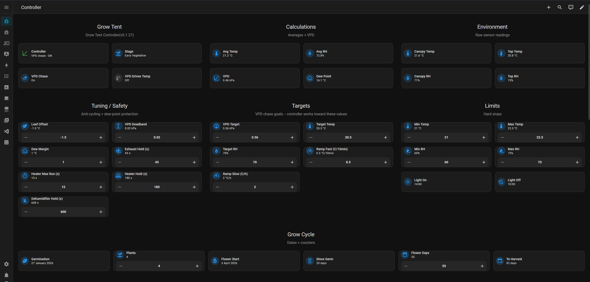

[](https://hacs.xyz/)
[](https://github.com/ferreirajcsf/small-grow-tent-controller/releases)
[](LICENSE)

# 🌱 Small Grow Tent Controller

A Home Assistant custom integration that automatically monitors and controls the environment inside a small grow tent — keeping temperature, humidity, and VPD where your plants need them, around the clock.

> **Status:** Active development (pre-1.0). Core control logic is stable. Expect occasional breaking changes until v1.0 is tagged.

---

## What does it do?

Running a grow tent means juggling a lot of variables — temperature, humidity, light schedules, airflow, and more. This integration takes care of all of it automatically, so you don't have to babysit your setup.

Every 10 seconds it reads your sensors, calculates VPD and dew point, and decides what to do with your connected devices. You just set your targets and let it run.

---

## Features

**Smart environmental control**
- Continuously chases your target VPD for each growth stage
- Calculates leaf-surface VPD (with configurable leaf temperature offset) for more accurate control
- Automatic dew point calculation and dew-point protection at night
- Hard safety limits for temperature and humidity that kick in before things go wrong
- Target conflict detection — warns you when your Target Temperature and Target Humidity settings imply a different VPD than your VPD Target

**Flexible device support**

All devices are optional — only enable what you actually have:

| Device | What it controls |
|---|---|
| 🔆 Light | On/off by schedule |
| 💨 Circulation fan | On whenever the controller is active (Auto), or manually forced On/Off |
| 🌬️ Exhaust fan | Temperature, humidity, and VPD management |
| 🔥 Heater | Temperature and night-time dew-point protection |
| 💧 Humidifier | VPD and humidity management |
| 🧊 Dehumidifier | VPD and humidity management |

**Growth stage presets**

Switch between stages and the controller automatically adjusts its VPD targets:

| Stage | Default VPD | Adjustable? |
|---|---|---|
| Seedling | 0.70 kPa | ✅ Yes |
| Early Vegetative | 0.95 kPa | ✅ Yes |
| Late Vegetative | 1.10 kPa | ✅ Yes |
| Early Bloom | 1.25 kPa | ✅ Yes |
| Late Bloom | 1.45 kPa | ✅ Yes |
| Drying | 0.90 kPa | ✅ Yes |

The **VPD Target** slider lets you nudge the target for the current stage at any time. When you switch stage, it resets to that stage's default automatically (~10 second delay).

**Grow Journal**
- Built-in timestamped grow log — record observations, training events, nutrient changes, anything
- Notes persist across restarts in HA's `.storage` directory
- Add notes from the dashboard via a text input; clear the last entry or all entries with one tap
- Accessible via the `small_grow_tent_controller.add_note` service for automations

**Safety features**
- Configurable heater max run time with automatic lockout
- **Exhaust safety** — when enabled, the exhaust fan cannot be turned off by *any* part of the control logic (including hard limits, night mode, VPD chase, or manual Off override) while temperature or humidity exceed the configured safety thresholds. This is a true system-wide safety, not just a manual-override guard.
- Anti-cycling protection via configurable hold times (prevents rapid on/off switching)
- Controller can be fully disabled while keeping manual device overrides active

**Per-device manual overrides**

Each device has an Auto / On / Off mode selector. Set any device to On or Off to override the controller for that device, or use the "Return All Devices to Auto" button to hand everything back to the controller in one tap. Overrides are enforced every poll cycle, so the controller will correct any unexpected state change within ~10 seconds.

**Entities created automatically**

Once set up, the integration creates a full set of entities grouped under a single device in your HA UI:
- Sensors for average temperature, humidity, VPD, dew point, leaf temperature, and control mode
- Switches for the controller itself, VPD Chase, and exhaust safety override
- Number sliders for all limits, deadbands, and hold times
- Select entities for growth stage and per-device modes
- Time helpers for your light on/off schedule
- A button to reset all devices to Auto

> **Tip:** There are also diagnostic `debug_*` sensors that show exactly what the controller is thinking (heater target, exhaust policy, light schedule logic, etc.). They're hidden by default — enable them individually via **Settings → Entities** if you want to dig into the details.

---

## Prerequisites

Before setting up the integration, you'll need:

- **Home Assistant** — any recent version with HACS support
- **2 temperature + 2 humidity sensors** — one set at canopy level, one at the top of the tent (the integration averages them). A single sensor at each location works fine too — just point both slots at the same entity.
- **Switch entities for your devices** — any device you want to control needs to be exposed as a `switch` entity in HA (smart plugs, Zigbee relays, etc.)

---

## Installation

### Option A — HACS (recommended)

1. In Home Assistant, open **HACS → Integrations**
2. Click the menu (⋮) in the top right → **Custom repositories**
3. Paste `https://github.com/ferreirajcsf/small-grow-tent-controller` and select **Integration** as the category
4. Click **Add**, then find and install **Small Grow Tent Controller**
5. Restart Home Assistant

### Option B — Manual

1. Download the latest release from the [Releases page](https://github.com/ferreirajcsf/small-grow-tent-controller/releases)
2. Copy the `custom_components/small_grow_tent_controller/` folder into your HA config directory:
   ```
   config/custom_components/small_grow_tent_controller/
   ```
3. Restart Home Assistant

---

## Configuration

### Step 1 — Add the integration

Go to **Settings → Devices & Services → Add Integration** and search for **Small Grow Tent Controller**.

### Step 2 — Choose your devices

The first screen asks which devices you actually have. Toggle off anything you don't want the controller to manage — this hides irrelevant entities and keeps your UI clean.

### Step 3 — Assign your entities

The second screen asks you to pick the HA entity for each sensor and device switch. These are the entities the integration will read from and control.

After setup, all entities appear under a single device card named after your config entry. If you run multiple tents, add the integration again and give each entry a different name (e.g. "Veg Tent", "Flower Tent").

### Step 4 — Set your targets

Once the integration is running, tune it from the entity controls in your dashboard or the device page:

| Setting | What it does |
|---|---|
| **Stage** | Sets the active growth stage and resets the VPD Target to its default |
| **VPD Target** | Target VPD for the current stage — adjustable per stage, resets on stage change |
| **VPD Chase** | When ON (default), actively chases VPD. When OFF, only hard limits are enforced |
| **Target Temperature** | The temperature the controller chases during VPD chase mode |
| **Target Humidity** | The humidity the controller nudges toward when VPD is in band |
| **Min / Max Temperature** | Hard limits — heater or exhaust kicks in if breached |
| **Min / Max Humidity** | Hard limits for RH |
| **VPD Deadband** | How far VPD can drift before the controller acts (default 0.07 kPa) |
| **Dew Point Margin** | How many °C above dew point the heater targets at night (default 1.0°C) |
| **Light On / Off Time** | Your light schedule — the controller follows this for day/night logic |
| **Hold Times** | Minimum time between switching each device (prevents rapid cycling) |
| **Grow Journal** | Use the dashboard text field to add dated notes; or call `small_grow_tent_controller.add_note` from an automation |
| **Heater Max Run Time** | Safety cutoff — heater is forced off and locked out if it runs too long (0 = disabled) |
| **Exhaust Safety Override** | When ON, prevents the exhaust from turning off above the safety thresholds (temp or RH), regardless of what triggered the turn-off |
| **Exhaust Safety Max Temperature / Humidity** | The thresholds used by the exhaust safety — exhaust stays on if either is exceeded |

---

## How the control logic works

The controller runs every 10 seconds and works through a priority stack — higher priorities always win.

### 1. Manual overrides
If any device is set to On or Off (not Auto), that device is locked to that state regardless of everything else. The desired state is enforced every cycle, so the controller will correct any external change within ~10 seconds. The rest of the controller still runs normally for Auto devices.

For the exhaust fan, if the manual mode is Off but the **Exhaust Safety** is enabled and a threshold is exceeded, the fan is kept on regardless of the override — the reason is logged as `override:off_blocked_by_safety`.

### 2. Disabled state
If the controller switch is off, automatic control stops. Manual overrides (On/Off modes) still work, but Auto devices are left alone. The exhaust safety still applies even in the disabled state.

### 3. Drying mode
When the stage is set to **Drying**, lights are always off and the controller enforces only hard temperature and humidity limits — no VPD chasing.

### 4. Heater safety trip
If the heater has been running continuously longer than **Heater Max Run Time**, it is immediately forced off and locked out for the heater hold period before it can turn on again.

### 5. Night mode (lights off window)
During the lights-off period the controller switches to **dew-point protection** mode. The heater runs in soft pulses to keep the air temperature above `dew point + margin`, preventing condensation on your plants. The exhaust fan behaviour at night depends on the stage:

| Stage | Night exhaust behaviour |
|---|---|
| Seedling | Auto — runs only if needed for dew-point protection |
| Early Vegetative | Auto — runs only if needed for dew-point protection |
| Late Vegetative | Auto — runs only if needed for dew-point protection |
| Early Bloom | Auto — runs only if needed for dew-point protection |
| Late Bloom | Auto — runs only if needed for dew-point protection |
| Drying | On continuously |

### 6. Day mode — hard limits
During the lights-on period, if temperature or humidity breach their min/max limits, the controller acts immediately:

| Condition | Response |
|---|---|
| Temp above max | Heater off + exhaust on |
| Temp below min | Heater on + exhaust off |
| RH above max | Exhaust on + dehumidifier on + humidifier off |
| RH below min | Exhaust off + humidifier on + dehumidifier off |

If the **Exhaust Safety** is enabled and its thresholds are exceeded, any attempt to turn the exhaust off (including from a hard limit like `temp_below_min`) is silently blocked — the fan stays on and the reason is logged with a `[SAFETY: blocked_off]` suffix.

### 7. Day mode — VPD chase
When everything is within limits and the **VPD Chase** switch is ON, the controller fine-tunes conditions by chasing the stage's VPD target within the configured deadband, using the heater, exhaust, humidifier, and dehumidifier as needed.

When VPD Chase is OFF, the controller operates in **limits-only mode**: devices are left neutral as long as temp and RH stay within their min/max limits. Useful for simpler thermostat/humidistat style control.

---

## Example Dashboard



An example Lovelace dashboard is included in the `Examples/` folder. It is structured across four views — Status, Targets, Devices, and Debug — so the most-used information is always front and centre.

**Required custom cards** (install via HACS):
- [layout-card](https://github.com/thomasloven/lovelace-layout-card)
- [Mushroom cards](https://github.com/piitaya/lovelace-mushroom)
- [card-mod](https://github.com/thomasloven/lovelace-card-mod)
- [fold-entity-row](https://github.com/thomasloven/lovelace-fold-entity-row)

**How to use it:**
1. Go to **Settings → Dashboards → Add Dashboard**
2. Give it a name and enable **YAML mode**
3. Paste the contents of `Examples/dashboard.yaml`
4. Update any entity IDs in the file to match your setup
5. Create a **Text helper** (Settings → Helpers → Text) named `Grow Note Input` — this powers the journal entry field in the dashboard

---

## Troubleshooting

**Entities are not appearing**
Make sure you restarted Home Assistant after installation. Check **Settings → System → Logs** for any errors from `small_grow_tent_controller`.

**Controller is stuck on `waiting_for_sensors`**
One or more of your sensor entities is unavailable or returning a non-numeric value. Check that all four sensor entity IDs in the integration config are correct and reporting valid readings.

**Devices are not switching**
Make sure the entity IDs you assigned in the config are `switch.*` entities and that Home Assistant can control them (test with a manual toggle from the HA UI first).

**A device override (On/Off) doesn't seem to be taking effect**
The controller enforces the desired state every ~10 seconds. If a device isn't responding, check that the switch entity is reachable and not reporting `unavailable` in HA.

**The exhaust fan won't turn off**
If the Exhaust Safety is enabled and your temperature or humidity is above the safety thresholds, the fan will refuse to turn off regardless of the control mode or manual override. Check the `debug_exhaust_reason` sensor — if it contains `[SAFETY: blocked_off]`, that's why. Lower your safety thresholds, or disable the Exhaust Safety if conditions are truly safe.

**Something seems wrong with the logic**
Enable the `debug_*` sensors via **Settings → Entities** — they show exactly what the controller is doing and why on every cycle.

---

## Reporting Issues

Found a bug or have a feature request? Open an issue at:
👉 https://github.com/ferreirajcsf/small-grow-tent-controller/issues

Please include:
- Home Assistant version
- Integration version
- A description of what you expected vs. what happened
- Relevant log entries (enable debug logging if possible)

---

## License

MIT — see [`LICENSE`](LICENSE)
